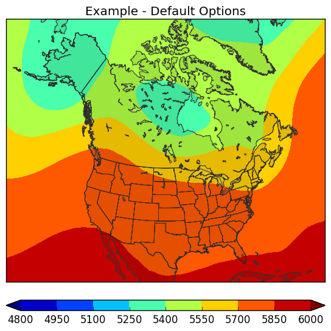

What is this package?
=====================

This package simplifies plotting geospatial data on top of a base map. It is intended to make plotting easy and uniform across multiple applications, while remaining flexible with options for changing the map projection, domain, plotting levels, and more. It's capable of plotting multiple fields as well.

How do I plot data?
===================

In `cpc.geoplot` a `Geomap` object defines *how the map will look*. It contains attributes such as `basemap` and `ax` (`mpl_toolkits.basemap.Basemap` object and `matplotlib.axes` object respectively), which define the axis and the underlying map, and other attributes that affect how the data will be plotted, such as colorbar options, domain, projection, title, etc.

A `Geofield` object defines *how the plotted field will look*. It contains attributes such as the data, plotting levels, fill/contour colors, etc.

Using these two objects a geospatial plot can be created. First import the dependencies:

```python
>>> from cpc.geogrids import Geogrid
>>> from cpc.geoplot import Geomap, Geofield
```

Next create a `Geomap`:

```python
map = Geomap()
```

Then load the data:

```python
import numpy as np
data = np.fromfile('/path/to/files/observation.bin', dtype='float32')
```

Then create a `Geofield` (which needs a [Geogrid](https://mikecharles.github.io/cpc.geogrids/)):

```python
geogrid = Geogrid('1deg-global')
field = Geofield(data, geogrid)
```

Finally plot the data and save it:

```python
map.plot(field)
map.save('out.png', dpi=100)
```

Here's the result:



Options
=======

Geomap options
-----------

The following options are available as parameters when calling `Geomap()`:

- `projection` - map projection (to get a list of supported projections call `cpc.geoplot.Geomap().get_supported_projections()`, defaults to equal-area)
- `domain` - map domain (to get a list of supported domains call `cpc.geoplot.Geomap().get_supported_domains()`, defaults to US)
- `cbar` - whether to plot the colorbar (defaults to True unless the first Geofield plotted has `fill_colors=False`)
- `cbar_ends` - type of colorbar ends (triangular [first and last colors indicate less than and greater than, respectively] or square, defaults to triangular)
- `cbar_type` - type of colorbar (normal or tercile [below, near, and above normal/median/etc.], defaults to normal)
- `cbar_color_spacing` - how colors are spaced on the colorbar (currently non-functional, will be implemented)
- `cbar_label` - label for the colorbar (defaults to an empty string)
- `cbar_tick_labels` - list of labels for the colorbar ticks (defaults to None, which leads to the colorbar being automatically labelled)
- `tercile_type` - type of tercile (affects labelling of the colorbar only, use something like normal or median)
- `title` - plot title (defaults to empty string, which results in no title being plotted)

Geofield options
-------------

The following options are available as parameters when calling `Geofield()`:

- `levels` - list of levels to contour/fill (defaults to auto, which results in the levels being automatically specified by `matplotlib.pyplot.contour[f]()`)
- `contour_colors` - [matplotlib color(s)](http://matplotlib.org/api/colors_api.html) (named color like r, red, black, etc., color tuples, or HEX colors) - can be a single color or a list of colors to cycle through
- `contour_labels` - whether to label contors (defaults to False)
- `smoothing_factor` - level of smoothing to apply to the data before plotting (0 means to smoothing, then any float for smoothing - higher values means more smoothing)
- `fill_colors` - [matplotlib color(s)](http://matplotlib.org/api/colors_api.html) (named color like r, red, black, etc., color tuples, or HEX colors) - can be a single color or a list of colors to cycle through
- `fill_coastal_vals` - whether to fill missing coastal values (usually found in course datasets) - essentially extends the data so that it covers points near the coast (really any points near a mask boundary, but coastal values are the most common, especially in coarse datasets) (defaults to False)

Examples
========
